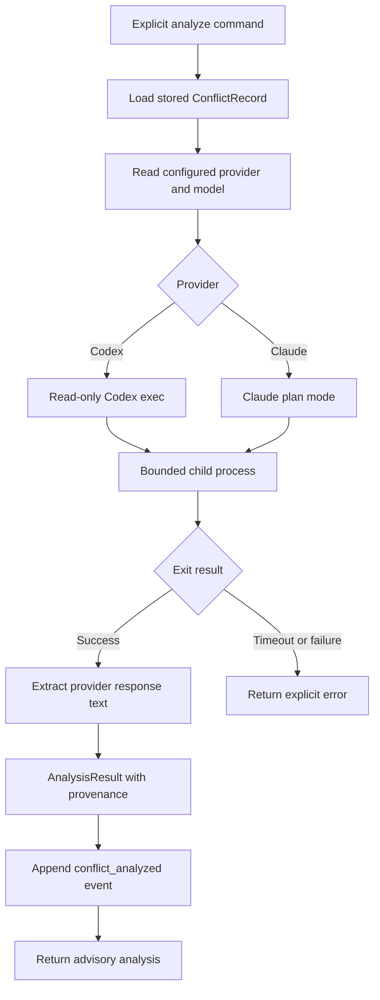

# Optional conflict analyst

## What this feature does

The analyst asks an explicitly configured local Codex or Claude command to summarize one stored conflict and suggest optional ways to coordinate. It augments deterministic classification; it does not classify severity, edit files, or decide whether an agent may proceed.

## Why it exists

A path-overlap rule can identify that two agents are likely to interfere, but a concise explanation may help a person or agent choose between splitting scope, sequencing work, handing off, accepting overlap, or requesting review. Because that explanation is probabilistic and may consume model resources, analysis is explicit rather than automatic in the latency-sensitive pre-tool path.

## Data flow

## Reading the flowchart

1. **Explicit analyze command** is invoked through CLI or MCP with a conflict identifier.
2. **Load stored ConflictRecord** ensures the analyst sees a typed, existing conflict rather than caller-supplied free-form context.
3. **Read configured provider and model** respects the user's provider, executable, model, reasoning effort, and timeout choices.
4. **Provider** selects exactly one configured implementation. Nexus does not silently fall back to another provider.
5. **Read-only Codex exec** uses a read-only sandbox and JSON output.
6. **Claude plan mode** invokes the print interface without edit permission.
7. **Bounded child process** supplies the prompt over stdin, captures output and error streams, and enforces the configured timeout.
8. **Exit result** distinguishes usable output from timeout, startup, or non-zero-exit failures.
9. **Extract provider response text** decodes the provider's external JSON shape at the integration boundary.
10. **AnalysisResult with provenance** records provider, selected model, conflict identifier, raw output, extracted text, and time.
11. **Append conflict_analyzed event** adds the resolved configuration hash so later readers know which user choices produced the result.
12. **Return advisory analysis** gives the caller suggestions without changing claims, conflicts, or permissions.

## Implementation details

`src/agents/analyst.rs` owns conflict-specific prompting and result provenance. `src/agents/model.rs` owns provider command construction, safe execution modes, timeout handling, and response extraction shared with commit review. `NexusService::analyze` owns conflict lookup and persistence because those are coordination responsibilities.

The prompt explicitly limits the analyst to read-only coordination advice. Severity remains the deterministic classifier's output. Analyst failures are ordinary explicit-command errors rather than hook decisions. Tests use a temporary fake Claude executable to validate provider selection, output extraction, and provenance storage without depending on an installed model client.
