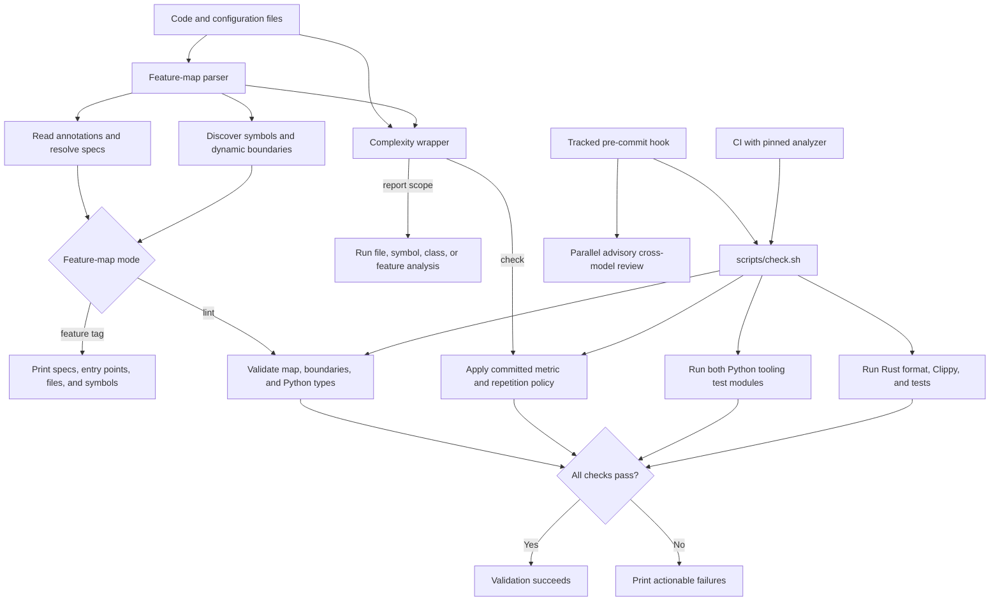

# Architecture tooling

## What this feature does

Architecture tooling gives agents and people a feature-shaped map of Nexus before they read or change code. Every scanned code file links itself to a feature specification, declares useful entry points, and marks intentional dynamic boundaries. The feature map reveals the complete surface for a feature or fails lint when the map is incomplete. One repository check composes it with the separately specified complexity-analysis feature and the Python and Rust validation suites.

## Why it exists

Directory names help, but they do not explain motivation, data flow, invariants, or the files where a cross-cutting feature begins. Search-by-symbol also encourages narrow edits before the reader understands the feature. The map makes feature context cheap enough to load first and makes stale documentation visible during ordinary linting.

It also supports DRY-vs.-WET review. Seeing every implementation attached to a feature makes similar flow, lifecycle, error handling, or change pressure easier to compare before another parallel implementation is added. Complexity and overlap results identify code worth reading, but do not by themselves justify splitting a deep implementation or merging code with different invariants.

## Data flow

## Reading the flowchart

1. **Code and configuration files** are discovered across the repository while generated, vendored, documentation, lock, and build-output paths are skipped.
2. **Feature-map parser** builds one repository model for exploration, lint, and feature-scoped complexity analysis.
3. **Read annotations and resolve specs** collects repeatable `@feature`, `@spec`, `@entrypoint`, and `@boundary` declarations, then verifies that referenced spec frontmatter matches each feature.
4. **Discover symbols and dynamic boundaries** enumerates Rust and Python symbols and SQL schema objects, and finds open-ended escape hatches such as JSON `Value`, TOML `Value`, `Any`, and string-to-any maps.
5. **Feature-map mode** selects exploration or enforcement from the same parsed model, avoiding separate indexes that could drift.
6. **Print specs, entry points, files, and symbols** gives a reader the smallest useful feature reading list for a selected tag.
7. **Validate map, boundaries, and Python types** ensures every scanned file participates in the map, each feature has a starting point, dynamic data is intentional, and Python functions are annotated.
8. **Complexity wrapper** translates repository, feature, path, symbol, and class scopes into `big-code-analysis` inputs while preserving Nexus feature ownership.
9. **Run file, symbol, class, or feature analysis** produces metrics and overlap evidence as review leads for a requested scope.
10. **Apply committed metric and repetition policy** makes `--check` use the reviewed BCA gates in `bca.toml` and the repository repetition policy in `complexity.toml`.
11. **`scripts/check.sh`** is the single local validation entry point and runs each required check from the repository root. On macOS it selects installed Command Line Tools so unrelated full-Xcode license state cannot break the Rust linker.
12. **Run both Python tooling test modules** verifies the feature-map and complexity-wrapper behavior together.
13. **Run Rust format, Clippy, and tests** keeps compiler-backed validation and the complete application suite in the same path.
14. **Tracked pre-commit hook** invokes the shared check after `scripts/install-hooks.sh` configures this checkout's `core.hooksPath`. It clears Git's repository-local environment variables for validation children so temporary test repositories resolve from their own working directories; the subsequent staged-diff review retains the hook's Git context.
15. **Parallel advisory cross-model review** runs code-architect and code-deletion perspectives after deterministic checks and prints their findings without converting them into a commit decision.
16. **CI with pinned analyzer** provisions Python 3.12, installs `big-code-analysis-cli==2.2.0` into that managed runtime, and invokes the same deterministic check on Linux and macOS.
17. **All checks pass** joins the independent deterministic results into one success or non-zero failure for hooks and CI.
18. **Validation succeeds** allows the caller to continue once every deterministic architecture, tooling, and Rust check passes.
19. **Print actionable failures** preserves the failing tool's diagnostics and stops the shared check immediately.

## Implementation details

`scripts/feature_map.py` implements exploration and annotation lint using only the Python standard library. It discovers Rust, Python, Elm, and TypeScript/JavaScript symbols and skips generated `dist`, `elm-stuff`, and dependency trees. The `complexity-analysis` feature owns `scripts/complexity_analysis.py`, the reviewed BCA gates in `bca.toml`, and repetition policy in `complexity.toml`; this feature only composes its `--check` contract. `scripts/check.sh` combines both linters, both Python test modules, locked frontend validation, formatting, Clippy, and Rust tests. It honors an explicit `PYTHON` interpreter and otherwise selects an available Python 3.11-or-newer executable when the default `python3` lacks the standard-library `tomllib` module. `.githooks/pre-commit` runs that deterministic script and then invokes the separately specified advisory commit review. `.github/workflows/ci.yml` deliberately calls only the deterministic script because CI has neither the implementation-model identity nor user model credentials. CI installs the analyzer and Node at pinned major versions before running it, while `scripts/install-hooks.sh` opts a local checkout into the tracked hook with repository-local Git configuration.

`AGENTS.md` contains the feature catalog and shared validation command. `tests/test_feature_map.py` verifies both a valid fixture and failures for missing Python types and an unmarked dynamic boundary; `tests/test_complexity_analysis.py` verifies the wrapper's scope translation, output, and threshold behavior. CI provisions Python 3.12 with `actions/setup-python` instead of modifying the runner's system-managed Python environment, keeping analyzer installation portable across Linux and macOS runners.

The annotation model is deliberately file-first. A file's feature set applies to every discovered block in it, which avoids repetitive comments while ensuring every block resolves to documented ownership. Mixed files may declare multiple features; persistent ambiguity is a signal that the file may need a better boundary.

Terminal validation also builds the locked standalone Pi-renderer bundle and rejects differences in tracked `pi-extension/dist` assets before Rust compiles them into the binary. The Rust suite includes real pseudo-terminal workflows, so passing frontend unit tests alone does not validate the native command or terminal cleanup.

Feature specifications follow one stable structure: plain-language purpose, motivation, one end-to-end flowchart, an explanation of every node and edge, and implementation details with entry points and invariants. The intended reader is technically strong, unfamiliar with the code, and tired enough that unexplained jumps are expensive.
