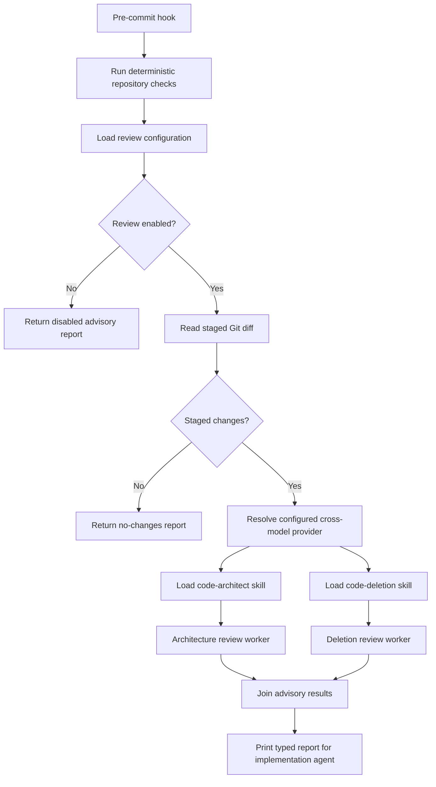

# Cross-model commit review

## What this feature does

Commit review automatically sends the staged Git diff to two independent, read-only review passes before a local commit completes. Both passes use a model other than the configured implementation model. One follows the code-architect skill; the other follows the code-deletion skill. They run concurrently and return advisory findings to the implementation agent.

## Why it exists

An implementation model is likely to share its own blind spots when it immediately reviews its work. A separately configured model provides a genuinely different pass. Architecture and deletion are deliberately separate perspectives: architecture checks interface depth, coupling, and types, while deletion hunts for replaced implementations, compatibility residue, stale flags, deprecated paths, and other removable satellites.

The review does not control agent execution. A finding or a reviewer failure is printed for follow-up, but it is not a permission decision and cannot deny the commit. Deterministic formatting, lint, complexity, and tests remain the enforceable pre-commit checks.

Both review passes have a high evidence threshold. Architecture review treats every retained line as a perpetual maintenance tax and rejects speculative defensive programming for states already excluded by the system's invariants. Deletion review may request a change only when the complete cleanup is strictly net negative in LOC. Either reviewer returns `PASS` instead of generic cautions when its threshold is not met.

## Data flow

## Reading the flowchart

1. **Pre-commit hook** is the automatic local entry point.
2. **Run deterministic repository checks** preserves the existing format, lint, complexity, and test gate before spending model resources.
3. **Load review configuration** resolves enablement, implementation and review providers, commands, models, reasoning effort, timeout, and optional skill root from the normal Nexus configuration stack.
4. **Review enabled** lets the user explicitly disable model consumption while leaving deterministic checks intact.
5. **Return disabled advisory report** records that the automatic review was intentionally skipped.
6. **Read staged Git diff** ensures reviewers see exactly the proposed commit rather than unrelated working-tree changes.
7. **Staged changes** avoids model calls when the command is invoked outside a real commit.
8. **Return no-changes report** makes that skip explicit and successful.
9. **Resolve configured cross-model provider** requires a provider different from the configured implementation provider.
10. **Load skills** uses the installed skill files as the single source of review policy for both Codex and Claude.
11. **Review workers** invoke the same safe model adapter concurrently with read-only or plan-mode permissions.
12. **Join advisory results** captures `PASS`, evidence-backed requested changes, provider error, or worker failure independently for each perspective.
13. **Print typed report** gives the implementation model both responses without converting either into a control decision.

## Implementation details

`src/agents/reviewer.rs` owns staged-diff collection, skill loading, prompts, parallel execution, and the typed report. `src/agents/model.rs` is the shared bounded process adapter used by both conflict analysis and commit review, avoiding parallel Codex/Claude implementations with the same lifecycle.

`review.implementation_provider` and `review.provider` must differ. Each provider has its own configurable command, model, and reasoning effort. The default is a Claude reviewer for Codex-authored changes. `review.skill_root` defaults to `$CODEX_HOME/skills` or `~/.codex/skills`.

The pre-commit hook deliberately catches review-command failure after printing it. Cross-model review informs cleanup; it does not own the work product or agent permission.
