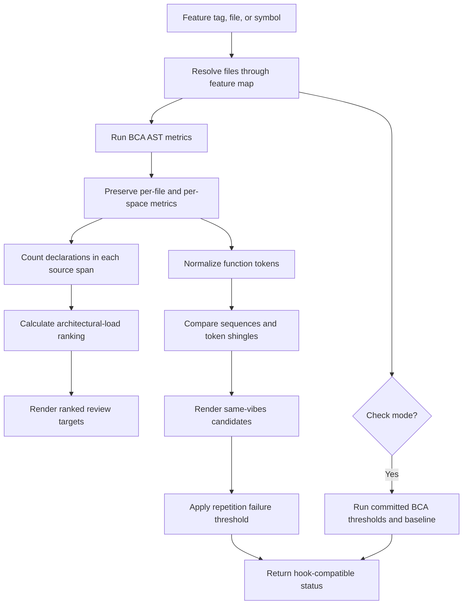

# Complexity analysis

## What this feature does

Complexity analysis turns source structure into review leads at repository, feature, file, class, and function scope. Big Code Analysis (BCA) provides AST-based metrics. A thin Nexus wrapper selects files from the feature map, adds an explicit declaration-weighted ranking, and finds functions with strongly overlapping normalized token sequences.

## Why it exists

Complexity is difficult to see across a whole feature, especially when its implementation crosses directories. Literal copy detection also misses parallel implementations whose names differ but whose flow and policy have the same shape. A single feature-aware command lets an agent locate both kinds of pressure before introducing another implementation.

Metrics are measurements rather than architectural verdicts. Nexus values deep methods that hide a coherent unit of work, so a high score must not be repaired by creating shallow wrappers. Repetition is likewise a prompt to compare invariants and change pressure, not an automatic instruction to merge code.

## Data flow

## Reading the flowchart

1. **Feature tag, file, or symbol** defines the requested analysis scope.
2. **Resolve files through feature map** reuses the architecture index instead of maintaining a second ownership map.
3. **Run BCA AST metrics** invokes the installed `bca` executable and requests its maintainability-oriented metric set as JSON.
4. **Preserve per-file and per-space metrics** retains BCA's file, class or container, function, and method hierarchy.
5. **Count declarations in each source span** adds the local concept-and-state signal requested by the architecture policy.
6. **Normalize function tokens** removes comments and literal or name differences while preserving keywords and operators.
7. **Calculate architectural-load ranking** applies the weights in `complexity.toml` to LLOC, arguments, declarations, cyclomatic complexity, and cognitive complexity.
8. **Compare sequences and token shingles** detects both similar ordering and large shared token regions.
9. **Render ranked review targets** shows the ranking beside raw metrics so the composite cannot conceal its causes.
10. **Render same-vibes candidates** identifies code pairs that deserve an invariant and ownership comparison.
11. **Check mode** separates read-only exploration from enforcement.
12. **Run committed BCA thresholds and baseline** uses `bca.toml` and `.bca-baseline.toml` as the shared local and CI quality gate.
13. **Apply repetition failure threshold** rejects only sufficiently large units that exceed the strict threshold in both sequence similarity and token-shingle containment, while one-signal and lower-confidence candidates remain advisory.
14. **Return hook-compatible status** makes the same command usable interactively, in Git hooks, and in CI.

## Implementation details

`scripts/complexity_analysis.py` is the sole project adapter. It accepts `--feature`, `--path`, and `--symbol`; without a scope it analyzes all annotated Rust and Python source. `--format json` makes the enriched records available to other tools. `--check` composes BCA's threshold result with the high-confidence repetition gate.

The architectural-load formula is `LLOC + 3 × arguments + 8 × declarations + 5 × max(cyclomatic - 1, 0) + 2 × cognitive`. It is deliberately configurable and used only for ranking. BCA's individual threshold rules remain the metric gate.

The wrapper analyzes authored Rust, Python, TypeScript, and JavaScript selected through the feature map. Generated frontend bundles are excluded. Elm is deliberately type-gated by the Elm compiler and behavior tests because BCA does not provide an Elm parser.

Normalized token similarity is a vibes check. Before abstraction, a reviewer must verify shared ownership, invariants, and reasons to change. Similar implementations with different invariants should remain separate and have that distinction recorded in review findings.
