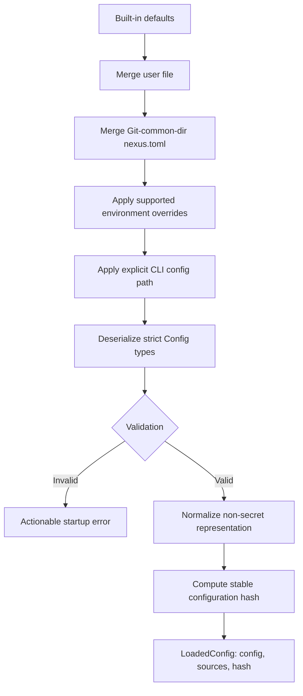

# Configuration

## What this feature does

Configuration gathers user and project decisions into one validated `LoadedConfig`. It supports defaults, a user properties file, a repository-specific file, selected environment overrides, and explicit CLI selection while retaining the source list and a stable hash.

## Why it exists

Nexus coordinates different agents and installations, so choices such as implementation and cross-model review providers, model names, storage paths, reconciliation timing, and privacy settings cannot be hard-coded. At the same time, silently accepting a misspelled property would make behavior unpredictable. Configuration therefore permits layering but rejects unknown or invalid final values.

## Data flow

## Reading the flowchart

1. **Built-in defaults** make a local installation runnable without a file.
2. **Merge user file** applies durable personal decisions from the default path or `NEXUS_CONFIG`.
3. **Merge Git-common-dir nexus.toml** lets all worktrees for one repository share project decisions.
4. **Apply supported environment overrides** handles process-specific storage, socket, analyst-provider, implementation-provider, and review-provider choices.
5. **Apply explicit CLI config path** gives a command or test deterministic control over its configuration source.
6. **Deserialize strict Config types** converts the temporary TOML tree into enumerated Rust records with unknown-field rejection.
7. **Validation** checks positive durations, supported schema versions, and internally consistent settings, including the requirement that implementation and review providers differ.
8. **Actionable startup error** stops explicit startup when configuration cannot be trusted.
9. **Normalize non-secret representation** excludes credentials by design; credentials belong to the selected external client.
10. **Compute stable configuration hash** creates provenance for sessions and analyst events.
11. **LoadedConfig** is the only configuration object passed into runtime and coordination.

## Implementation details

`src/config.rs` owns defaults, merge precedence, environment handling, validation, project-file discovery, and hashing. The temporary `toml::Value` exists only inside this annotated configuration boundary; typed structs are used everywhere after loading.

All configuration structs reject unknown fields. `ModelProvider` is an enum, and analyst and commit-review settings each select provider-specific command and model records. Review configuration also owns enablement, timeout, and an optional installed-skill root. Tests verify merge precedence, selected model values, cross-model validation, unknown-property rejection, and invalid numeric values. `config.example.toml` is annotated and should remain synchronized with the typed schema.
