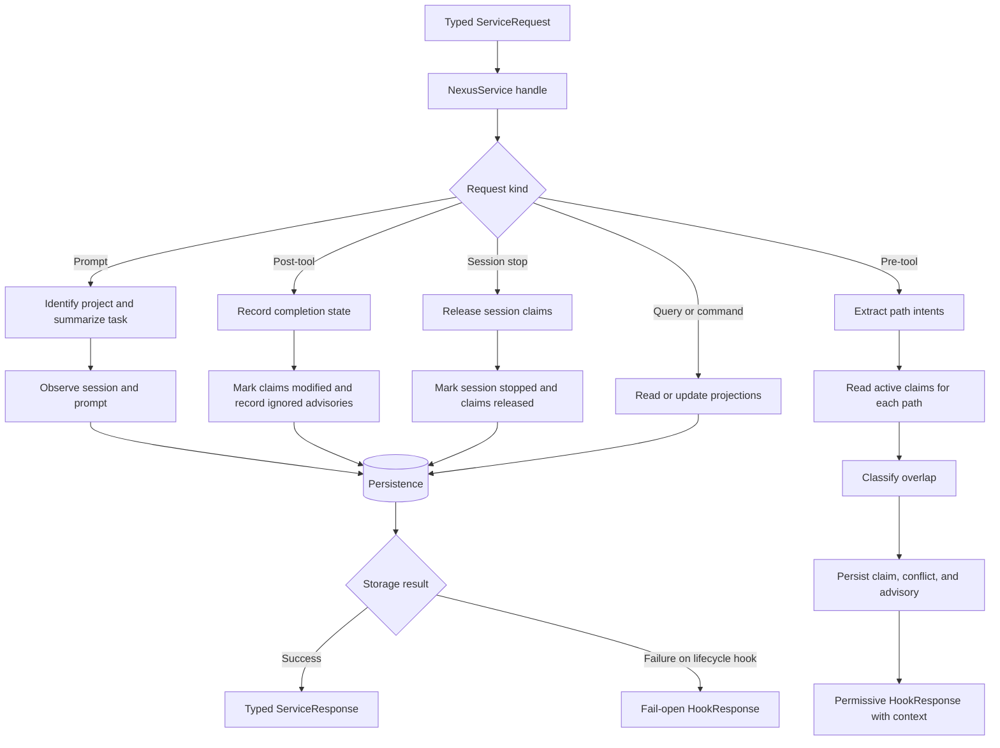

# Coordination

## What this feature does

Coordination turns an agent's lifecycle activity into useful, non-binding context for other agents. It recognizes which paths an agent intends to change, remembers those intentions as expiring claims, compares new work with existing work, and reports overlap without taking control away from either agent.

The central promise is deliberately narrow: Nexus helps an agent see concurrent work; it never decides whether the agent may proceed. Every hook response remains permissive, including malformed-input and storage-failure paths.

## Why it exists

Two capable agents can independently make reasonable changes that collide because neither can see the other's local intent. Git exposes the collision late, after work has already been duplicated or implementations have diverged. Coordination moves that information earlier while preserving each agent's responsibility for its own work product.

Path claims are therefore signals, not locks. Severity describes likely coordination cost, not permission. A destructive overlap or overlapping line range deserves stronger context than two known, disjoint hunks, but neither becomes an enforcement decision.

## Data flow

## Reading the flowchart

1. **Typed ServiceRequest** is the closed service boundary. Runtime adapters decode wire JSON before coordination begins, so the core does not dispatch on arbitrary method strings or maps.
2. **NexusService handle** is the deep entry point. It accepts one request and owns sequencing, storage locking, error translation, and the advisory-only invariant.
3. **Request kind** selects one enumerated workflow. Adding a workflow requires extending the request and response types rather than inventing another loosely shaped payload.
4. **Identify project and summarize task** uses the canonical Git common directory when available. This gives worktrees one shared identity while retaining the current worktree for reconciliation.
5. **Extract path intents** translates tool-specific payloads into typed path, operation, and optional line-range records. Unknown tools produce no claims rather than guessed claims.
6. **Read active claims for each path** considers claims from other sessions that have not expired or been released.
7. **Classify overlap** deterministically assigns informational, warning, or critical severity based on operations and line ranges. When one session has several active claims on the path, Nexus returns only its strongest overlap so repeated edits do not flood the caller with duplicate advice.
8. **Persist claim, conflict, and advisory** records both history and queryable projections before returning context. A project, path, and unordered session pair identify one conflict projection. Its severity is monotonic: weaker observations cannot hide an active stronger overlap. Resolution remains stable until a later observation is strictly more severe, which reopens the projection with an explicit event. Each advisory occurrence remains in history.
9. **Permissive HookResponse with context** always reports `permitted: true`. Advisories are information for the calling agent.
10. **Record completion state** records success or failure. Successful tool calls move matching claims to `modified`; configured history can note that an advisory was knowingly crossed.
11. **Release session claims** ends a session's active coordination footprint without deleting history.
12. **Read or update projections** covers status, event, session, claim, conflict, usage, memory, resolution, release, and explicit analysis commands. Capability observations and agent memory share the typed service boundary but remain separate features and projections from coordination history.
13. **Persistence** is a separate capability. Coordination asks for domain operations and receives typed records rather than Diesel rows or JSON maps.
14. **Storage result** preserves normal errors for explicit commands but converts lifecycle failures or contention into an immediate fail-open response, so background reconciliation cannot hold up an agent tool call.

## Implementation details

The primary entry point is `NexusService::handle` in `src/coordination/service.rs`. `ServiceRequest` and response records live in `api.rs`; domain states such as `RecordScope`, `ConflictScope`, `ToolCompletion`, `ClaimState`, and `Severity` live in `domain.rs`. Memory request handling is delegated to the feature-scoped service module and returns typed memory-domain values; provider consolidation never runs in a lifecycle request.

`classifier.rs` owns deterministic tool-payload extraction and overlap classification. `usage_detection.rs` separately identifies conservative script invocations inside observed shell commands; analytics normalization and fail-open recording live in `usage.rs`. Open-ended tool input is isolated behind `ToolPayload`; these extractors may inspect that boundary value, but storage and service interfaces do not accept anonymous maps. `workspace.rs` isolates Git process execution and canonical project identity.

The main invariants are:

- lifecycle responses are always permissive;
- a claim never grants exclusivity;
- the classifier, not an LLM, determines severity;
- project identity is stable across Git worktrees;
- dynamic tool shapes do not escape the extraction boundary;
- each other session contributes at most one advisory per inspected path;
- Git reconciliation observes edits that bypass hooks only for sessions seen within the claim TTL, so abandoned sessions cannot keep claims alive.

Unit tests cover extraction, severity, typed request decoding, and service overlap behavior. Process tests in `tests/mcp_hooks.rs` exercise the same flows through a real MCP process, daemon socket, and SQLite database.
