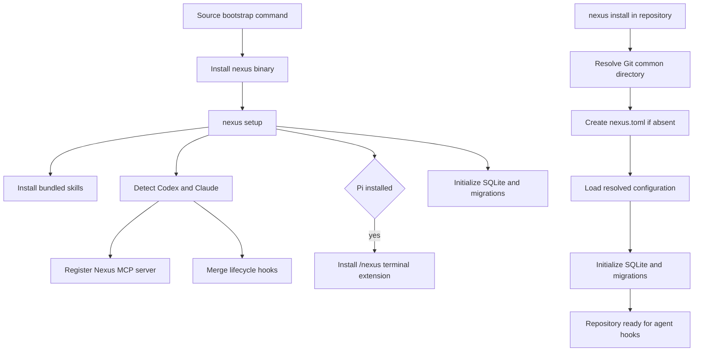

# Installation

## What this feature does

Installation reduces Nexus onboarding to one machine command and one repository command. Machine setup installs the review skills, registers the Nexus MCP server with every supported coordination host already present, merges lifecycle hooks without deleting unrelated settings, installs the read-only Pi terminal extension when Pi is present, and initializes local storage. Repository installation creates shared Git-common-directory configuration and runs database migrations.

## Why it exists

Coordination is only useful when every agent is connected consistently. A checklist that asks users to copy skills, execute provider-specific registration commands, merge JSON by hand, and initialize each repository invites partial installations that appear healthy until agents overlap. Nexus should own that incidental complexity behind two stable commands.

## Data flow

## Reading the flowchart

1. **Source bootstrap command** is the only machine-facing command that depends on the source checkout.
2. **Install nexus binary** uses Cargo's locked dependency graph and places the executable on the user's Cargo path.
3. **nexus setup** owns all machine-wide Nexus integration after the binary exists.
4. **Install bundled skills** places the exact architecture, deletion, and TDD policies where Nexus and supported agents can discover them.
5. **Detect Codex and Claude** configures only hosts whose commands are executable.
6. **Register Nexus MCP server** replaces the named `nexus` registration with the installed executable path.
7. **Merge lifecycle hooks** removes earlier Nexus entries and appends the current generated entries while retaining unrelated settings and hooks. Per-turn events use the registered MCP server; session teardown uses the installed executable as a command hook because hosts no longer expose MCP context then.
8. **Initialize SQLite and migrations** opens the configured store, which applies every unseen embedded Flyway migration.
9. **nexus install in repository** is the one repository-local command.
10. **Resolve Git common directory** gives all worktrees one configuration and project identity.
11. **Create nexus.toml if absent** preserves existing user decisions and otherwise writes only the supported schema version.
12. **Load resolved configuration** applies normal user, repository, environment, and CLI precedence.
13. **Repository ready for agent hooks** means the already-installed host integrations will coordinate sessions in that repository.
14. **Pi installed** is detected with the same executable probe used for supported hosts; an absent Pi installation does not affect setup.
15. **Install `/nexus` terminal extension** writes the bundled TypeScript modules to Pi's global extension directory. Re-running setup replaces only changed Nexus extension files.

## Implementation details

`setup_machine` and `install_repository` in `src/installation.rs` are the two deep entry points. Setup is idempotent: skill and Pi-extension contents are replaced only when different, the named MCP registration is refreshed, and generated Nexus hook entries replace only prior Nexus entries. Repository installation never overwrites an existing `nexus.toml`.

The source bootstrap entry point is `./scripts/install.sh`. It installs with Cargo's locked dependency graph into `NEXUS_INSTALL_ROOT`, `CARGO_HOME`, or the normal `~/.cargo` prefix in that order, then calls the installed binary's `nexus setup` command. A future hosted installer should delegate to this same boundary rather than duplicate setup policy.

`tests/installation.rs` exercises both commands as child processes with isolated homes and provider binaries. The ignored real-agent test exercises the packaged install plus two worktrees using authenticated Codex and Claude clients; it must be requested explicitly because it consumes model resources and requires external credentials.
