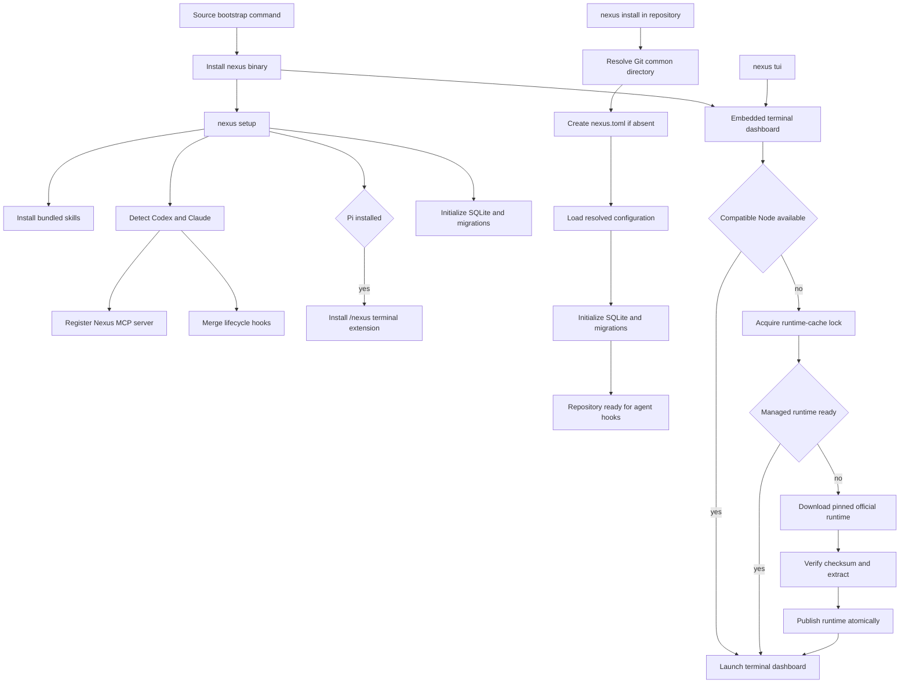

# Installation

## What this feature does

Installation reduces Nexus onboarding to one machine command and one repository command. Machine setup installs the review skills, registers the Nexus MCP server with every supported coordination host already present, merges lifecycle hooks without deleting unrelated settings, installs the Pi terminal extension when Pi is present, and initializes local storage. Repository installation creates shared Git-common-directory configuration and runs database migrations. The installed binary also bundles the standalone terminal dashboard opened by `nexus tui`; opening it never requires a separate Pi installation.

## Why it exists

Coordination is only useful when every agent is connected consistently. A checklist that asks users to copy skills, execute provider-specific registration commands, merge JSON by hand, and initialize each repository invites partial installations that appear healthy until agents overlap. Nexus should own that incidental complexity behind two stable commands.

## Data flow

## Reading the flowchart

1. **Source bootstrap command** is the only machine-facing command that depends on the source checkout.
2. **Install nexus binary** uses Cargo's locked dependency graph and places the executable on the user's Cargo path.
3. **nexus setup** owns all machine-wide Nexus integration after the binary exists.
4. **Install bundled skills** places the exact architecture, deletion, and TDD policies where Nexus and supported agents can discover them.
5. **Detect Codex and Claude** configures only hosts whose commands are executable.
6. **Register Nexus MCP server** replaces the named `nexus` registration with the installed executable path.
7. **Merge lifecycle hooks** removes earlier Nexus entries and appends the current generated entries while retaining unrelated settings and hooks. Per-turn events use the registered MCP server; session teardown uses the installed executable as a command hook because hosts no longer expose MCP context then.
8. **Initialize SQLite and migrations** opens the configured store, which applies every unseen embedded Flyway migration.
9. **nexus install in repository** is the one repository-local command.
10. **Resolve Git common directory** gives all worktrees one configuration and project identity.
11. **Create nexus.toml if absent** preserves existing user decisions and otherwise writes only the supported schema version.
12. **Load resolved configuration** applies normal user, repository, environment, and CLI precedence.
13. **Repository ready for agent hooks** means the already-installed host integrations will coordinate sessions in that repository.
14. **Pi installed** is detected with the same executable probe used for supported hosts; an absent Pi installation does not affect setup.
15. **Install `/nexus` terminal extension** writes the bundled TypeScript modules to Pi's global extension directory, including the always-on fail-open analytics transport. Re-running setup replaces only changed Nexus extension files.
16. **Embedded terminal dashboard** is compiled into the Rust executable along with its pinned Pi TUI renderer and license notices. It does not load a Pi agent process or require model credentials.
17. **Compatible Node available** accepts an executable on `PATH` whose version meets the renderer's Node 22.19+ requirement. The command uses it without altering the machine's Node installation.
18. **Acquire runtime-cache lock** serializes first-launch provisioning across Nexus processes. The runtime and content-addressed dashboard files live under `tui/` beside the configured SQLite database, outside the source checkout by default.
19. **Managed runtime ready** permits offline reuse of an already installed runtime when no suitable Node is on `PATH`.
20. **Download pinned official runtime** fetches Node 24.21.0 over HTTPS with bounded connection and transfer timeouts. Provisioning uses the machine's `curl` and `tar`, supports Linux/macOS x64/arm64, and needs no package-manager command from the user.
21. **Verify checksum and extract** checks the compiled-in SHA-256 from Node's [official release checksums](https://nodejs.org/dist/v24.21.0/SHASUMS256.txt), extracts only the executable and license into a temporary cache directory, and confirms the executable runs before installation.
22. **Publish runtime atomically** renames the complete runtime into place while holding the cache lock. Failed downloads, checksum checks, or extraction leave no published partial runtime and remove their temporary directory; a later `nexus tui` can retry.
23. **Launch terminal dashboard** uses the shared standalone adapter documented in observability-ui and inherits the user's terminal streams.

## Implementation details

`setup_machine` and `install_repository` in `src/installation.rs` are the two deep entry points. Setup is idempotent: skill and Pi-extension contents are replaced only when different, the named MCP registration is refreshed, and generated Nexus hook entries replace only prior Nexus entries. Repository installation never overwrites an existing `nexus.toml`.

The source bootstrap entry point is `./scripts/install.sh`. It installs with Cargo's locked dependency graph into `NEXUS_INSTALL_ROOT`, `CARGO_HOME`, or the normal `~/.cargo` prefix in that order, then calls the installed binary's `nexus setup` command. A future hosted installer should delegate to this same boundary rather than duplicate setup policy.

`tests/installation.rs` exercises both commands as child processes with isolated homes and provider binaries. The ignored real-agent test exercises the packaged install plus two worktrees using authenticated Codex and Claude clients; it must be requested explicitly because it consumes model resources and requires external credentials.

`src/runtime/terminal.rs` owns the native launcher and embedded dashboard materialization; `terminal_runtime.rs` owns runtime selection and verified installation behind `ensure_node`. Runtime tests use local archive fixtures to prove verification, atomic publication, failed-install cleanup, and reuse. `tests/tui.rs` exercises the real packaged view through a pseudo-terminal with no Pi on `PATH`, then repeats offline with neither Pi nor Node on `PATH`. `tests/tui_terminal.py` also provides an explicit `download` scenario for testing official first-launch provisioning without making the deterministic test suite depend on the network.
