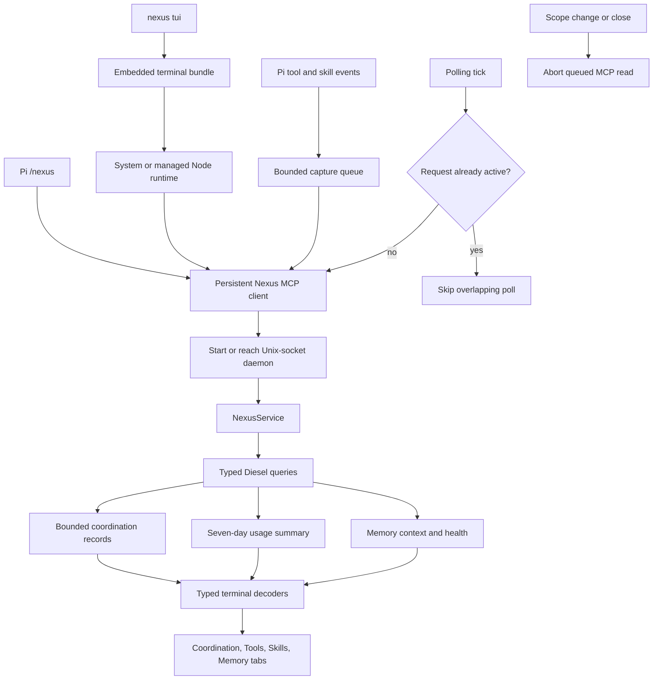

# Terminal observability UI

## What this feature does

Nexus has two entry points for one terminal interface: the bundled `nexus tui` command and `/nexus` inside Pi. Both render the same Coordination, Tools, Skills, and Memory tabs. Coordination progressively discloses sessions, claims, conflicts, and events. Tools and Skills show rolling seven-day horizontal bar charts. Memory browses and searches notes, adds an explicitly scoped raw note, expands or invalidates a derived summary, and requests consolidation.

All data travels through one persistent local `nexus mcp` child per interface. Coordination, project, usage, and memory reads use the same typed service boundary as the CLI. Memory requests carry correlated host context. Nexus does not serve a web application or an HTTP API, and the repository contains no HTML, CSS, Elm, or other browser assets.

`nexus tui` embeds the terminal renderer and dashboard bundle. It uses a compatible Node runtime already on `PATH` or installs a pinned, verified runtime into the local Nexus cache. It requires no Pi installation, agent login, or model credentials. The Pi extension uses its host's renderer and also observes tool calls and explicit skill invocations through a bounded, fail-open capture queue.

## Why it exists

Agent-facing advisories solve immediate collisions, but a person still needs a compact operational view of repositories, sessions, claims, conflicts, tool activity, skill activity, and memory health. Keeping the interface in the terminal avoids a second network listener, browser frontend toolchain, and browser security surface while remaining available both inside Pi and directly from the CLI.

Progressive disclosure keeps recent operational state first. The initial Coordination page answers whether Nexus is healthy, where work is happening, and whether conflicts are open. Full payloads and metadata appear only after a person selects a category and record. Coordination and analytics are read-only; only explicit Memory-tab operations mutate state, and immutable raw notes cannot be edited or deleted.

## Data flow

## Reading the flowchart

1. **Pi `/nexus`** opens the interface inside an interactive Pi session.
2. **`nexus tui`** opens the same interface directly from the command line with inherited terminal streams.
3. **Embedded terminal bundle** packages the shared dashboard and narrow standalone host in the Rust binary.
4. **System or managed Node runtime** runs the bundle without installing Pi; first use can provision a verified runtime that later works offline.
5. **Persistent Nexus MCP client** is shared by dashboard reads, memory operations, and—inside Pi—analytics capture and first-prompt memory activation.
6. **Bounded capture queue** preserves Pi responsiveness when Nexus is slow or unavailable.
7. **Start or reach Unix-socket daemon** keeps daemon launch and retry behavior behind the MCP adapter.
8. **NexusService** exposes typed projects, dashboard, usage, and memory requests without presentation concerns.
9. **Typed Diesel queries** read existing projections; terminal hosts do not duplicate persistence logic.
10. **Bounded coordination records** include exact counts and explicit truncation flags.
11. **Seven-day usage summary** contains tool, script, and skill counts plus capture health.
12. **Memory context and health** remain on the local protocol and are delimited as untrusted data when injected into a model session.
13. **Typed terminal decoders** reject malformed dynamic responses before they enter component state.
14. **Coordination, Tools, Skills, Memory tabs** present the shared keyboard-driven component in either host.
15. **Polling tick** refreshes only the active surface and never overlaps a prior polling request.
16. **Skip overlapping poll** bounds work while a previous request is active.
17. **Abort queued MCP read** removes stale scope requests before backpressure can send them.

## Implementation details

`src/persistence/dashboard.rs` owns the read model and keeps database access in Diesel's typed DSL. `DashboardRecords` returns exact scoped counts alongside bounded record windows. Project summaries remain global so a selected repository can always be changed from the same view. The `[ui]` configuration section controls terminal polling and record-window bounds.

The shared terminal UI lives under `pi-extension/`. `client.ts` maps typed dashboard, project, and usage reads onto the MCP client. `domain.ts` validates their wire shapes. `navigation.ts` owns Coordination's progressive-disclosure state. `polling.ts` owns independent single-flight dashboard and analytics refresh lifecycles. `usage.ts` and `usage-pane.ts` render seven-day bar summaries. `component.ts` composes the four tabs.

`mcp-client.ts` owns the persistent correlated child, out-of-order response matching, bounded backpressure, request timeouts, and queued-request cancellation. `capture.ts` owns fail-open Pi tool and skill listeners. The memory modules own strict response decoding, activation, prompts, and pane interactions. `index.ts` wires these components into Pi.

`terminal.ts` provides the standalone host using the Pi TUI package alone. `terminal-dialogs.ts` supplies focused input and selection overlays through the shared memory prompt interface, and `theme.ts` defines the small theme contract supported by either host. `pi-extension/build.mjs` bundles that host and its pinned renderer into tracked `pi-extension/dist/nexus-tui.mjs`, including third-party license notices.

`src/runtime/terminal.rs` embeds the bundle, materializes a content-addressed copy outside the checkout, and replaces the launcher process with the selected runtime. `terminal_runtime.rs` owns compatible-runtime detection and verified installation. Real pseudo-terminal tests run with Pi absent, exercise navigation and memory operations, verify explicit configuration and repository paths containing spaces, and check terminal restoration. Another scenario proves cached offline startup without Node on `PATH`.

Repository validation installs the single locked Pi-extension Node tree, runs its typecheck and tests, rebuilds the tracked terminal bundle, and then runs the Rust and architecture gates. Installed users need no frontend build tools.
