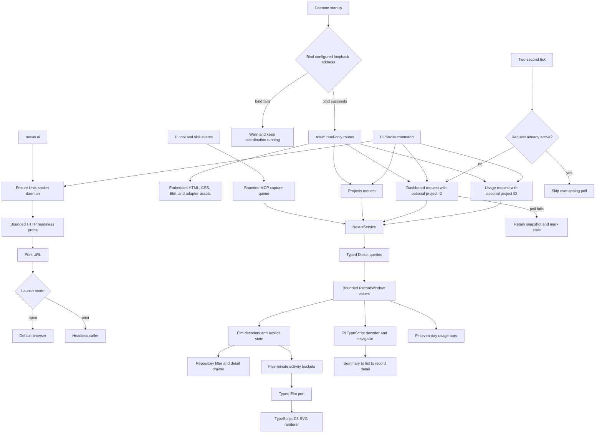

# Browser and Pi observability UI

## What this feature does

The observability UI is a compact, read-only operations console for people supervising Nexus. It shows recent activity across every repository on the machine, or one explicitly selected repository, without adding a control surface to agent work. The dashboard summarizes active sessions and advisory claims, open conflicts, and bounded event history. Both interfaces progressively disclose full records only after a person selects a category and record; the browser also shows a one-hour activity timeline.

`nexus ui` is the human entry point. It ensures that the existing daemon is running, waits briefly for the local HTTP listener, prints the dashboard URL, and normally opens the default browser. `nexus ui --launch print` performs the same readiness work without opening a browser, which is useful over SSH and in automated tests.

The bundled Pi extension is the terminal entry point. When Pi is installed, `nexus setup` copies the extension to `~/.pi/agent/extensions/nexus/`. `/nexus` starts or locates the same loopback service and opens a keyboard-driven view inside Pi. Its top-level tabs are Coordination, Tools, and Skills; Tab and Shift-Tab move between them. Coordination keeps the existing progressive record navigation, while Tools and Skills show rolling seven-day horizontal bar charts for the selected project or all projects. `j`/`k` scroll detail, Escape moves back, `r` refreshes, and `q` closes the view. Dashboard polling runs while Coordination is active; the slower analytics poll runs only while Tools or Skills is visible, retains the last successful summary after an error, and never adds Nexus mutation tools to Pi.

The extension also observes Pi tool calls whenever it is loaded, whether or not `/nexus` is open. One persistent `nexus mcp` child receives best-effort pre/post tool events and explicit `/skill:name` invocations through a bounded queue. Capture failures and backpressure cannot alter Pi tool execution.

## Why it exists

Agent-facing advisories solve the immediate collision problem, but a person still needs to understand whether coordination is healthy and where activity is concentrating. Terminal queries expose individual projections but make it difficult to see relationships among repositories, sessions, claims, conflicts, and time. This feature composes those existing records into one snapshot while keeping observation isolated from coordination. If the browser, frontend bundle, or HTTP port fails, the Unix-socket service continues coordinating agents.

The interface uses progressive disclosure because recent operational state matters first. The initial page answers “is Nexus healthy, where is work happening, and are there conflicts?” Full event payloads and record metadata appear only after a person selects a row. The UI never resolves a conflict, releases a claim, starts analysis, or blocks an agent.

## Data flow

## Reading the flowchart

1. **nexus ui** is the only new CLI workflow. It reuses daemon startup rather than creating a second service process.
2. **Ensure Unix-socket daemon** establishes that coordination is available before looking for the optional dashboard listener.
3. **Bounded HTTP readiness probe** prevents an indefinite wait when UI startup fails.
4. **Print URL** always gives the person a copyable address before browser launch is attempted.
5. **Launch mode** is an enum, not a boolean. `open` is interactive and `print` is headless.
6. **Default browser** is convenience only. Launch failure emits a warning after readiness succeeds.
7. **Daemon startup** owns both local listeners so they share configuration and the typed service.
8. **Bind configured loopback address** rejects non-loopback configuration before startup. A runtime port collision is deliberately non-fatal.
9. **Axum read-only routes** accept only `GET`, validate the `Host` header, omit CORS, and attach a restrictive content-security policy plus no-store and no-sniff headers.
10. **Embedded assets** are compiled and tracked at development time. Installed users need neither Node nor Elm.
11. **Projects request** derives machine-wide project summaries from existing sessions; no project table or migration is required.
12. **Dashboard request** asks for one deep snapshot and carries an optional project ID for explicit filtering.
13. **NexusService** keeps HTTP concerns outside coordination and exposes the same typed request boundary used by other adapters.
14. **Typed Diesel queries** read the existing events, sessions, claims, and conflicts tables without raw SQL.
15. **RecordWindow values** carry both items and a `truncated` fact, so bounded history is visible rather than silently incomplete.
16. **Elm state** distinguishes loading, refreshing, ready, stale, and failed data. The last successful snapshot survives a failed poll.
17. **Repository filter and detail drawer** are entirely local presentation state. Filtering does not change stored records.
18. **Five-minute activity buckets** are classified and aggregated in Elm over the last hour.
19. **Typed Elm port** sends only chart-ready buckets across the JavaScript boundary.
20. **TypeScript D3 renderer** owns SVG construction, keyed updates, axes, and resize handling. It does not interpret Nexus records.
21. **Two-second tick** uses the configured refresh interval embedded in the snapshot.
22. **Skip overlapping poll** prevents a slow request from creating an unbounded request queue.
23. **Retain snapshot and mark stale** keeps useful context visible while the next tick retries naturally.
24. **Pi `/nexus` command** calls `nexus ui --launch print` with fixed arguments, validates that the returned URL is loopback HTTP, and reuses the projects, dashboard, and usage endpoints.
25. **Pi decoder and navigator** keep open JSON at the HTTP boundary, convert it into typed records, and expose overview, record-list, and detail pages without duplicating coordination queries.
26. **Summary to list to record detail** keeps the default terminal footprint small. Project selection changes only the read scope, and automatic polling preserves the selected page and row when possible.

## Implementation details

`src/runtime/web.rs` owns the Axum adapter, embedded assets, security headers, local readiness check, and non-fatal bind behavior. `src/main.rs` owns the typed launch mode. `src/persistence/dashboard.rs` owns the read model and keeps every database operation in Diesel's typed DSL. `DashboardRecords` is the single deep service interface: it returns exact scoped counts alongside bounded recent record windows. Project summaries remain global so a selected repository can always be changed from the same page.

The browser frontend lives under `ui/`. `Main.elm` owns the application model, update loop, responsive semantic markup, project choice, and keyboard dismissal. `Nexus.Domain` owns wire decoders, event classification, and five-minute aggregation; `Nexus.Polling` owns the small state machine that prevents overlapping polls and preserves stale data. `activity-chart.ts` is the only D3 surface. It accepts a closed `ActivityBucket` type and updates one SVG root, including an accessible empty state. `bootstrap.ts` contains only port wiring and resize observation.

The Pi frontend lives under `pi-extension/`. `client.ts` owns process startup, loopback URL validation, and HTTP reads; `domain.ts` validates the wire shape; `navigation.ts` owns coordination's progressive-disclosure state; `polling.ts` owns independent single-flight dashboard and analytics refresh lifecycles; `usage.ts` and `usage-pane.ts` own the seven-day bar presentation and tab state; and `component.ts` composes them. `capture.ts` owns the persistent fail-open MCP transport and Pi event listeners. `index.ts` only registers capture and `/nexus`. Runtime imports use Pi's public extension and TUI packages, while repository checks type-check against the pinned API version.

`ui/build.mjs` compiles optimized Elm, bundles authored TypeScript and D3 with esbuild, and copies static HTML and CSS into `ui/dist`. The dist directory is committed because Rust embeds it with `include_str!`. Repository checks install both locked Node trees, run Elm, browser TypeScript, and Pi-extension tests, type-check authored TypeScript, rebuild the browser assets, and reject an unstaged bundle difference. Feature mapping reads authored Elm and TypeScript symbols while skipping `dist`, `elm-stuff`, and `node_modules`; big-code-analysis examines the authored TypeScript but the Elm compiler and tests are the Elm type gate.

The default server is `127.0.0.1:7337`. Configuration requires a loopback `SocketAddr` and positive refresh and record limits. Remote serving, authentication, streaming updates, and mutation controls are deliberately outside this feature.
