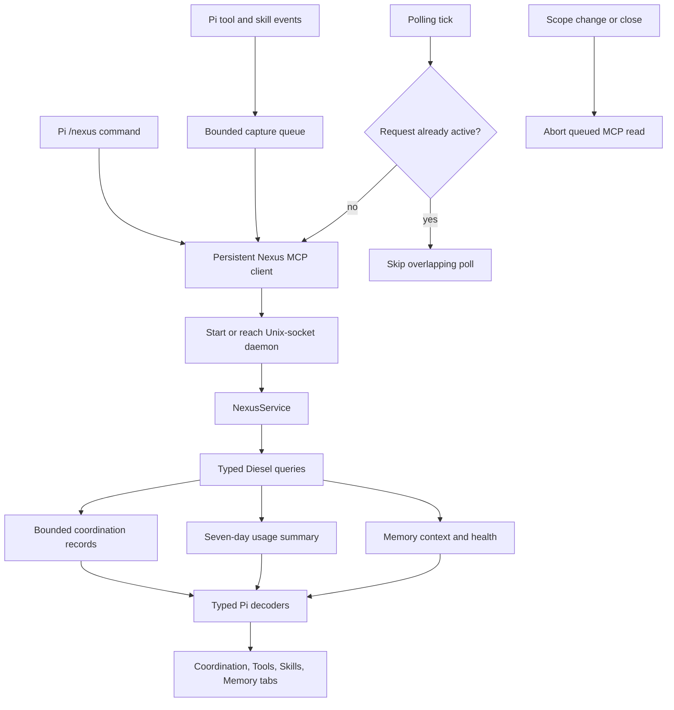

# Pi observability UI

## What this feature does

Nexus has one interactive UI: the terminal-native `/nexus` view bundled for Pi. Its tabs are Coordination, Tools, Skills, and Memory. Tab and Shift-Tab move between them. Coordination progressively discloses sessions, claims, conflicts, and events. Tools and Skills show rolling seven-day horizontal bar charts. Memory browses and searches notes, adds an explicitly scoped raw note, expands or invalidates a derived summary, and requests consolidation.

All data travels through one persistent local `nexus mcp` child. Coordination, project, and usage reads use the same typed service boundary as the CLI. Memory requests carry correlated Pi session context. Nexus does not serve a web application or an HTTP API, and the repository contains no browser assets.

The extension also observes Pi tool calls whenever it is loaded, whether or not `/nexus` is open. The persistent MCP child receives best-effort pre/post tool events and explicit `/skill:name` invocations through a bounded queue. Capture failures and backpressure cannot alter Pi tool execution.

## Why it exists

Agent-facing advisories solve immediate collisions, but a person still needs a compact operational view of repositories, sessions, claims, conflicts, tool activity, skill activity, and memory health. The terminal interface keeps that visibility inside the agent environment without adding a second network listener, frontend toolchain, or browser security surface.

Progressive disclosure keeps recent operational state first. The initial Coordination page answers whether Nexus is healthy, where work is happening, and whether conflicts are open. Full payloads and metadata appear only after a person selects a category and record. Coordination and analytics are read-only; only explicit Memory-tab operations mutate state, and immutable raw notes cannot be edited or deleted.

## Data flow

## Reading the flowchart

1. **Pi `/nexus` command** requires interactive terminal mode and opens the keyboard-driven component.
2. **Persistent Nexus MCP client** is shared by analytics capture, first-prompt memory activation, dashboard reads, and Memory-tab operations.
3. **Bounded capture queue** preserves Pi responsiveness when Nexus is slow or unavailable.
4. **Start or reach Unix-socket daemon** keeps daemon launch and retry behavior behind the MCP adapter.
5. **NexusService** exposes typed projects, dashboard, usage, and memory requests without presentation concerns.
6. **Typed Diesel queries** read existing projections; the Pi adapter does not duplicate persistence logic.
7. **Bounded coordination records** include exact counts and explicit truncation flags.
8. **Seven-day usage summary** contains tool, script, and skill counts plus capture health.
9. **Memory context and health** remain on the local protocol and are delimited as untrusted data when injected into a model session.
10. **Typed Pi decoders** reject malformed dynamic responses before they enter component state.
11. **Polling tick** refreshes only the active surface and never overlaps a prior polling request.
12. **Abort queued MCP read** removes stale scope requests before backpressure can send them.

## Implementation details

`src/persistence/dashboard.rs` owns the read model and keeps database access in Diesel's typed DSL. `DashboardRecords` returns exact scoped counts alongside bounded record windows. Project summaries remain global so a selected repository can always be changed from the same view. The `[ui]` configuration section controls Pi polling and record-window bounds.

The terminal UI lives under `pi-extension/`. `client.ts` maps typed dashboard, project, and usage reads onto the shared MCP client. `domain.ts` validates their wire shapes. `navigation.ts` owns Coordination's progressive-disclosure state. `polling.ts` owns independent single-flight dashboard and analytics refresh lifecycles. `usage.ts` and `usage-pane.ts` render seven-day bar summaries. `component.ts` composes the four tabs.

`mcp-client.ts` owns the persistent correlated child, out-of-order response matching, bounded backpressure, timeouts, and queued-request cancellation. `capture.ts` owns fail-open tool and skill listeners. The memory modules own strict response decoding, activation, prompts, and pane interactions. `index.ts` wires these components into Pi.

Repository validation installs only the locked Pi Node tree, runs its TypeScript typecheck and tests, and then runs the Rust and architecture gates. Installed users need neither Node nor a frontend build toolchain.
