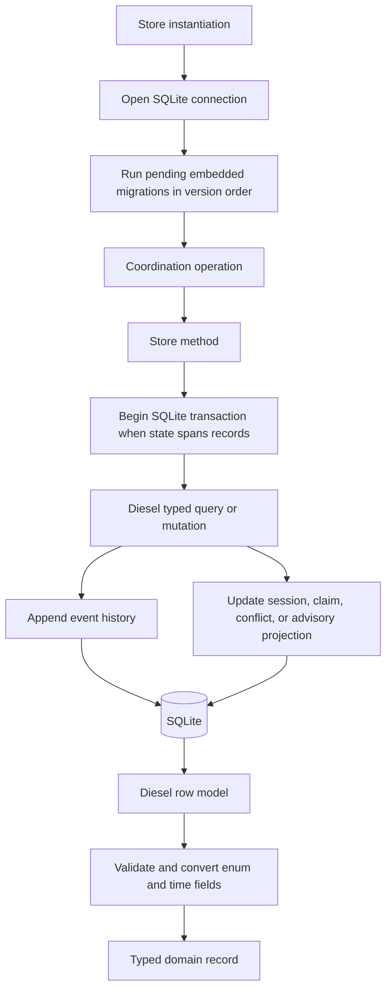

# Persistence

## What this feature does

Persistence gives Nexus a durable event history and fast, typed views of current coordination state. It stores sessions, claims, conflicts, and advisories in SQLite while exposing domain records to the rest of the application.

## Why it exists

Coordination information must survive short-lived MCP calls and separate agent processes. An append-only history explains how the current state arose, while projections answer immediate questions without replaying every event. Diesel is used so schema-facing queries remain checked by Rust rather than being assembled as SQL strings throughout the application.

## Data flow

## Reading the flowchart

1. **Store instantiation** is the single database lifecycle entry point used by the daemon, doctor command, tests, and direct readers.
2. **Open SQLite connection** creates the database file and its parent directory when they do not exist.
3. **Run pending embedded migrations in version order** creates a fresh schema or upgrades an existing database before any store method is available. `flyway-rs` records deployed versions in `flyway_migrations`, skips them on reopen, and applies each new script transactionally.
4. **Coordination operation** supplies already validated identifiers, intents, completion states, or query scopes.
5. **Store method** is the persistence interface. Internal mutation helpers are crate-private; callers cannot depend on Diesel row layouts.
6. **Begin SQLite transaction** groups changes that must be observed together, such as updating a projection and appending its event.
7. **Diesel typed query or mutation** uses generated schema columns and query combinators. Runtime SQL strings are not an application API.
8. **Append event history** records why a state change occurred and includes enough structured payload for inspection.
9. **Update projection** maintains the current view used by status and list commands.
10. **SQLite** provides one local, transactional database shared by the daemon's requests.
11. **Diesel row model** mirrors storage representation, including string-backed timestamps and enums.
12. **Validate and convert** rejects unknown enum strings or malformed timestamps instead of leaking storage primitives.
13. **Typed domain record** is returned to coordination and serialized only later by a runtime adapter.

## Implementation details

`src/persistence/store.rs` owns application transactions and Diesel queries. `migrations.rs` adapts the public `flyway-rs` state and executor traits to the same Diesel SQLite connection model. `models.rs` owns row and insert models plus conversion into domain records. `schema.rs` contains Diesel's generated table declarations, including the migration history table. SQL appears only under `migrations/`, where it defines schema objects.

`Store::open` runs the compile-time embedded `flyway-rs` migration store before opening the application connection. Migration files are immutable, monotonically versioned `V<version>_<description>.sql` scripts. Existing scripts are never rewritten or deleted after release; schema changes add a later file. Migration zero bootstraps Flyway's own typed history table. The runner uses one transaction per changelog and stops on the first failure. The migration test first applies only version zero, upgrades through version two, and reopens the database to prove already-deployed versions do not run twice.

The event and advisory tables preserve individual observations. Sessions, claims, and conflicts are current projections. A conflict has a stable identity derived from its project, path, and unordered session pair, so detecting the same overlap again updates one conflict instead of creating competing open records. Projection severity only escalates; equal or weaker observations preserve both its strongest evidence and an explicit resolution. A stronger observation reopens a resolved projection and records that transition. Claim expiration is evaluated in queries, and reconciliation only refreshes claims for recently seen sessions. Repeated observation of the same still-active Git change refreshes its projection without duplicating event history. States are converted into `ClaimState`, `SessionStatus`, and `ConflictStatus` before leaving persistence.

Important transactional groupings include session observation plus its event, claim insertion plus its event, conflict plus advisory creation, successful completion plus claim state change, and session stop plus claim release. Tests open both in-memory and filesystem-backed databases and inspect typed projections after real hook traffic.
