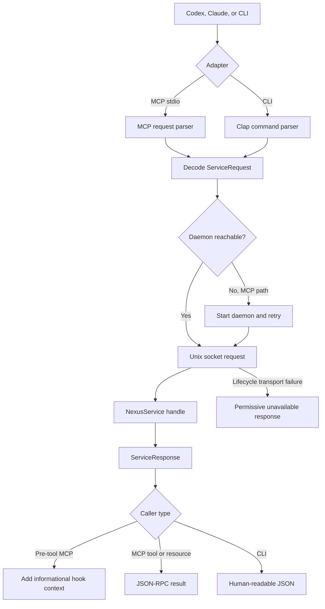

# Runtime and host integration

## What this feature does

Runtime connects agent hosts and people to the coordination core. It provides the command-line interface, a local Unix-socket daemon, an MCP stdio server, MCP resources, and generated hook configuration for Codex and Claude.

## Why it exists

Agent hosts speak different lifecycle protocols and launch tools as separate processes. The coordination core should not know those wire formats or process lifecycles. Runtime absorbs protocol JSON, daemon startup, connection retries, and host-specific hook shapes while presenting one typed request to coordination.

## Data flow

## Reading the flowchart

1. **Codex, Claude, or CLI** is the external caller. Host hook files invoke MCP tools; people invoke commands directly.
2. **Adapter** selects the protocol-specific edge without changing coordination semantics.
3. **MCP request parser** handles JSON-RPC initialization, tools, resources, calls, and reads.
4. **Clap command parser** converts explicit CLI flags into typed command and scope values.
5. **Decode ServiceRequest** is the point where loose wire values stop. Unknown methods and invalid shapes do not enter the core.
6. **Daemon reachable** checks the configured local socket. MCP may start the daemon because hosts expect a self-contained tool command.
7. **Start daemon and retry** uses bounded retries and the configured executable; it does not hide an indefinitely broken daemon.
8. **Unix socket request** sends a small method-and-params envelope locally.
9. **NexusService handle** performs the feature work described in the coordination specification.
10. **ServiceResponse** is serialized only after the core has completed.
11. **Add informational hook context** transforms advisories into model-visible context without emitting deny, approval, or input-rewrite fields.
12. **JSON-RPC result** serves both tools and read-only resources.
13. **Human-readable JSON** keeps CLI status and query commands inspectable and scriptable.
14. **Permissive unavailable response** preserves agent autonomy when Nexus cannot be reached.

## Implementation details

`src/runtime/mcp.rs` is the MCP entry point and tool catalog. `daemon.rs` owns socket lifecycle, one-daemon locking, typed request dispatch, and background Git reconciliation ticks. `src/main.rs` owns command parsing and maps CLI flags such as `--all` to explicit domain scopes before making a request.

`src/agents/integration.rs` generates registration commands and host hook fragments. Host-specific differences remain data and small enum dispatches: Claude supports failure and session-end hooks that Codex may not expose in the same way. Both use MCP tool hooks and neither receives a blocking decision from Nexus.

The runtime boundary intentionally handles `serde_json::Value`, because JSON-RPC and MCP are open wire protocols. That dynamic data is annotated as a boundary and decoded into typed requests before service execution. Process-level tests launch the real daemon and MCP binaries, verify auto-start and fail-open behavior, and inspect the resulting database state.
