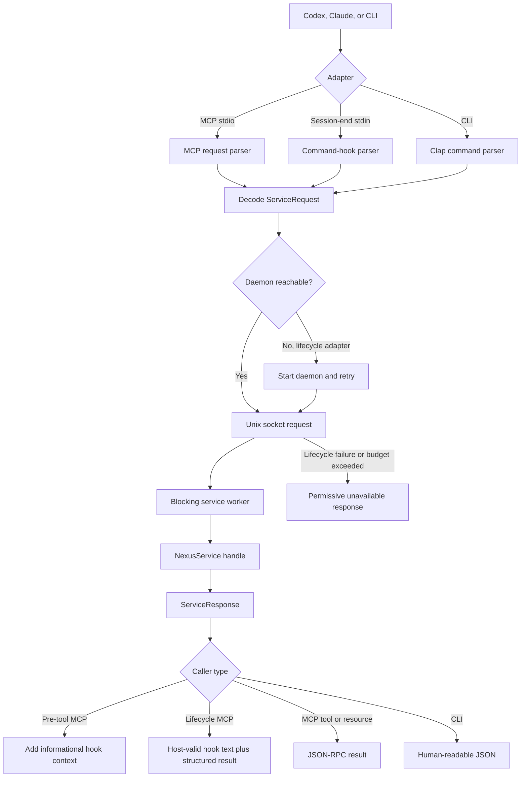

# Runtime and host integration

## What this feature does

Runtime connects agent hosts and people to the coordination core. It provides the command-line interface, a local Unix-socket daemon, an MCP stdio server, a loopback read-only HTTP adapter, MCP resources, generated hook configuration for Codex and Claude, and the `nexus exec -- PROGRAM [ARG ...]` analytics fallback.

## Why it exists

Agent hosts speak different lifecycle protocols and launch tools as separate processes. The coordination core should not know those wire formats or process lifecycles. Runtime absorbs protocol JSON, daemon startup, connection retries, and host-specific hook shapes while presenting one typed request to coordination.

## Data flow

## Reading the flowchart

1. **Codex, Claude, or CLI** is the external caller. Host hook files invoke MCP tools during a session and a command hook at session end; people invoke commands directly.
2. **Adapter** selects the protocol-specific edge without changing coordination semantics.
3. **MCP request parser** handles JSON-RPC initialization, tools, resources, calls, and reads. Each request is answered on its own task and responses are written in completion order, because hosts multiplex hooks from many threads and parallel tool calls over one connection; a slow explicit tool must not queue lifecycle hooks behind it.
4. **Command-hook parser** converts session-end stdin into a typed stop request and emits no hook output.
5. **Clap command parser** converts explicit CLI flags into typed command and scope values.
6. **Decode ServiceRequest** is the point where loose wire values stop. Unknown methods and invalid shapes do not enter the core.
7. **Daemon reachable** checks the configured local socket. Lifecycle adapters may start the daemon because hosts expect a self-contained hook command.
8. **Start daemon and retry** uses bounded retries and the configured executable; it does not hide an indefinitely broken daemon.
9. **Unix socket request** sends a small method-and-params envelope locally.
10. **Blocking service worker** isolates synchronous database and model-process work from the asynchronous socket runtime, so one slow explicit command cannot starve unrelated lifecycle connections.
11. **NexusService handle** performs the feature work described in the coordination specification.
12. **ServiceResponse** is serialized only after the core has completed.
13. **Add informational hook context** transforms advisories into model-visible context without emitting deny, approval, or input-rewrite fields.
14. **Host-valid hook text plus structured result** keeps internal coordination fields in MCP `structuredContent` while returning only the JSON fields accepted by the lifecycle event. A no-op lifecycle result is `{}`.
15. **JSON-RPC result** serves explicit tools and read-only resources.
16. **Human-readable JSON** keeps CLI status and query commands inspectable and scriptable.
17. **Permissive unavailable response** preserves agent autonomy when Nexus cannot be reached, its store is busy with background observation, or the daemon does not answer within the lifecycle response budget. The budget covers daemon start-up and is shorter than every generated host hook timeout, so a host never reports a failed hook call because Nexus was slow.

## Implementation details

`src/runtime/mcp.rs` is the MCP entry point and tool catalog. Alongside coordination hooks it exposes typed skill observations and seven-day usage queries. `hooks.rs` decodes the host's session-end stdin and releases the session without writing hook output. `daemon.rs` owns socket lifecycle, one-daemon locking, typed request dispatch, background Git reconciliation ticks, and `lifecycle_request`, the single bounded fail-open path used by MCP lifecycle tools, analytics observations, and the session-end command hook. Each decoded service request runs on Tokio's blocking pool because coordination deliberately uses synchronous Diesel connections and model subprocesses; the async listener and unrelated connections therefore remain responsive. `script_exec.rs` runs an explicitly wrapped child with inherited stdio, reports a privacy-safe script identity after completion, and returns the child's exit status even if capture fails. `src/main.rs` owns command parsing and maps CLI flags such as `--all` to explicit domain scopes before making a request.

`src/agents/integration.rs` generates registration commands and host hook fragments. Host-specific differences remain data and small enum dispatches: Claude exposes a distinct tool-failure event. Both hosts use MCP tool hooks while their MCP client exists and an absolute-path command hook for `SessionEnd`, which cannot use MCP. Neither receives a blocking decision from Nexus.

`src/runtime/web.rs` is the optional observability adapter described in the observability-ui specification. It shares `NexusService` with the Unix listener, serves only embedded assets and typed read requests, including `/api/v1/usage`, and treats bind failure as a warning. `nexus ui` ensures the daemon exists and performs a bounded HTTP readiness check; browser launch remains a best-effort convenience.

The runtime boundary intentionally handles `serde_json::Value`, because JSON-RPC and MCP are open wire protocols. That dynamic data is annotated as a boundary and decoded into typed requests before service execution. Process-level tests launch the real daemon and MCP binaries, verify auto-start and fail-open behavior, and inspect the resulting database state.
