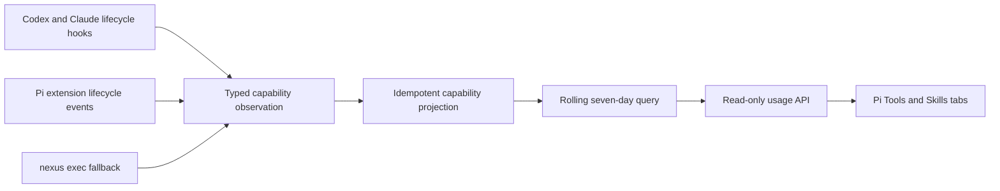

# Usage analytics

## What this feature does

Usage analytics records the tools, skills, and repository scripts that Nexus observes agent hosts using. It presents a rolling seven-day summary in the Pi `/nexus` interface so a person can assess whether installed tools and skills are changing agent behavior.

The metrics are explicitly observational. Nexus captures local lifecycle events exposed by Codex, Claude, and Pi, but does not claim visibility into hosted tools or processes launched beneath an opaque command.

## Why it exists

Installing agent tools and skills does not show whether agents actually use them. Generic coordination events are bounded for display, may contain private output, and cannot reliably deduplicate completion hooks, so they are not a sound analytics source. A typed fact projection gives each observed invocation a stable identity and keeps privacy-sensitive arguments and output out of aggregate reporting.

## Data flow

## Required behavior

- Tool starts and completions upsert one invocation keyed by project, host, session, kind, and invocation ID. A completion received without a start still creates the invocation.
- Script executions are child capability uses derived conservatively from shell commands. The outer shell tool remains visible, and wrapper-backed observations do not create a second inferred script row.
- Skill uses retain their evidence method. Explicit Pi `/skill:name` input is authoritative; successful direct reads and conservative read-only shell commands targeting `SKILL.md` provide inferred evidence for hosts without a skill lifecycle hook. Stronger evidence promotes an existing same-turn observation rather than incrementing the count.
- Stored analytics contain typed identity, source, outcome, timestamps, and optional model metadata, but never raw arguments, environment values, tool output, or error text.
- Queries use a server-defined rolling seven-day window, support global and project scope, and return deterministic count ordering.
- Lifecycle capture is advisory and fail open. Charts are labeled as observed by Nexus, and capture health exposes received, recorded, and dropped observations without claiming visibility into events that never reached Nexus.
- The Pi extension captures events whenever loaded, independently of whether `/nexus` is open. Capture uses a bounded asynchronous queue and cannot change a tool result.
- `nexus exec -- PROGRAM [ARG ...]` is an exact fallback for scripts that automatic shell-command inference cannot identify. It preserves child stdio and exit behavior.

## Implementation details

Persistence owns the normalized capability projection and typed Diesel aggregates. Coordination converts host lifecycle input into observations and performs deterministic script and skill evidence extraction. Runtime exposes lifecycle ingestion and typed usage reads through MCP. The Pi extension owns automatic host-event forwarding, independent analytics polling, tab state, and terminal bar rendering.

Existing dashboard event windows are not an analytics source. Usage aggregation runs separately and less frequently so the high-frequency coordination dashboard does not increase lifecycle-store contention.
